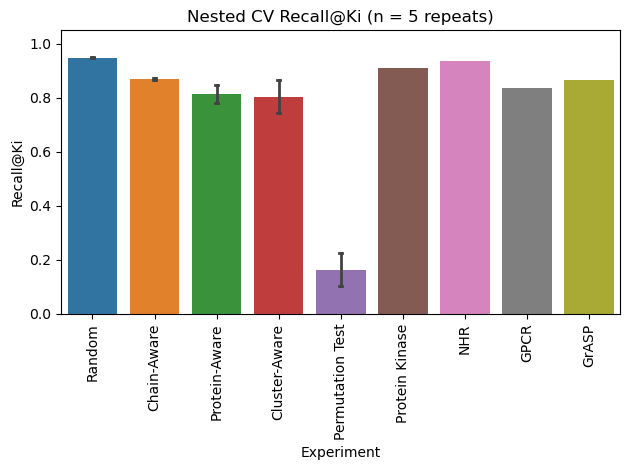

# PocketBagger
PU Bagging for Pocket Druggability Classification

PocketBagger employs positive-unlabeled learning using the bagging approach published by Mordelet et al (https://www.sciencedirect.com/science/article/pii/S0167865513002432).

See our pre-print at https://doi.org/10.64898/2026.05.15.725505.  The manuscript is currently under review.

Multiple splitting strategies were employed to evaluate our approach, including random, chain-aware, protein-aware, 30% identity sequence-cluster-aware, and targeted family holdouts.

In addition to the base classifier, we additionally employ an isolation forest trained solely on positives as an auxillary model to consider protein pocket druggability/ligandability from a different perspective.

PocketBagger predictions are deployed in canSAR.ai, with the model parameters tuned using the 30% identity sequence-cluster-aware splitting strategy.
