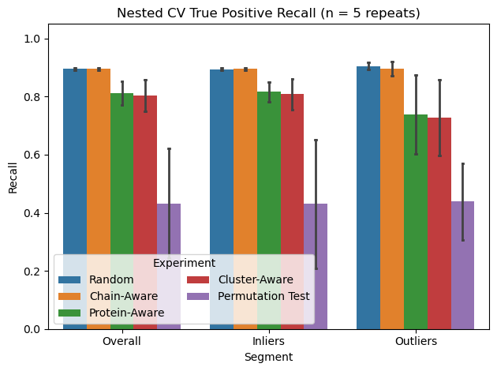

# PocketBagger
PU Bagging for Pocket Druggability Classification

See our pre-print at https://doi.org/10.64898/2026.05.15.725505.  The manuscript is currently under review.

PocketBagger employs positive-unlabeled learning using the bagging approach published by Mordelet et al (https://www.sciencedirect.com/science/article/pii/S0167865513002432). In addition to the base classifier, we employ an isolation forest trained solely on positives as an auxillary model to consider protein pocket druggability/ligandability from a different perspective.

Multiple splitting strategies were employed to evaluate our approach, including random, chain-aware, protein-aware, and 30% identity sequence-cluster-aware to probe generalizability. Further segmentation of performance was considered to inlier/outlier labels assigned by the isolation forest model. The permutation tests demonstrates real signal was observed during training of the model. As expected, performance on the outlier segment generally declined, but was also accompanied by an increase in variability as indicated in the figure below.

PocketBagger predictions are deployed in canSAR.ai, with the model parameters tuned using the 30% identity sequence-cluster-aware splitting strategy.
